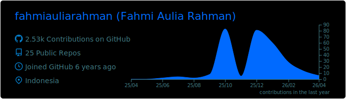
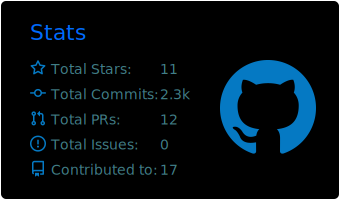
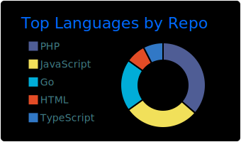

# Hi, I'm Fahmi 👋

**Software Engineer at [Loket.com](https://loket.com)** | Jakarta, Indonesia

I craft scalable full stack systems by day and build Neovim plugins or anything by night. Passionate about developer tooling and always open to exciting collaborations.

---

### What I'm Building

🔌 **Neovim Plugins** — Creating tools to enhance developer productivity

- [droid.nvim](https://github.com/fahmiauliarahman/droid.nvim) - Factory AI integration for Neovim
- [json2go.nvim](https://github.com/fahmiauliarahman/json2go.nvim) - JSON to Go struct converter
- [goctl.nvim](https://github.com/fahmiauliarahman/goctl.nvim) - Go-zero framework tooling
- Coming soon: a battle tested and ready to go template for backend development backed by golang.

---

### Open to Collaborate

I'm actively looking to collaborate on:

- **Neovim/Lua plugins** — Let's build better dev tools together
- **Backend systems** — APIs, microservices, high-traffic architectures
- **Open source** — Always happy to contribute

**Got an interesting project?** [Let's connect!](#connect)

---

### Currently Learning

 Deep diving into Lua for Neovim plugin development & scripting

---

### Communities

---

### Tech Stack

**Languages**

---

### GitHub Stats

  

  
  

---

### Connect

---

  

